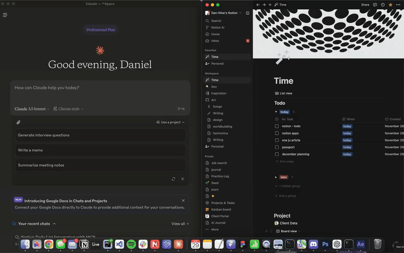

# Notion MCP Integration

A simple Model Context Protocol (MCP) server that integrates with Notion's API to manage my personal todo list through Claude. This is a basic implementation tailored specifically for my minimalist todo list setup in Notion.

<p align="center">
  
</p>

## Important Note

This is a personal project designed for a very specific use case: my simple Notion todo list that has just three properties:
- Task (title)
- When (select with only two options: "today" or "later")
- Checkbox (marks if completed)

[Example Notion Database](https://danhilse.notion.site/14e5549555a08078afb5ed5d374bb656?v=14e5549555a081f9b5a4000cdf952cb9&pvs=4)

While you can use this as a starting point for your own Notion integration, you'll likely need to modify the code to match your specific database structure and requirements.

## Features

- Add new todo items
- View all todos
- View today's tasks
- Check off a task as complete

## Prerequisites

- Python 3.10 or higher
- A Notion account
- A Notion integration (API key)
- A Notion database that matches the exact structure described above (or willingness to modify the code for your structure)

## Setup

1. Clone the repository:
```bash
git clone https://github.com/yourusername/notion-mcp.git
cd notion-mcp
```

2. Set up Python environment:
```bash
python -m venv .venv
source .venv/bin/activate  # On Windows use: .venv\Scripts\activate
uv pip install -e .
```

3. Create a Notion integration:
   - Go to https://www.notion.so/my-integrations
   - Create new integration
   - Copy the API key

4. Share your database with the integration:
   - Open your todo database in Notion
   - Click "..." menu → "Add connections"
   - Select your integration

5. Create a `.env` file:
```env
NOTION_API_KEY=your-api-key-here
NOTION_DATABASE_ID=your-database-id-here
```

6. Configure Claude Desktop:
```json
{
  "mcpServers": {
    "notion-todo": {
      "command": "/path/to/your/.venv/bin/python",
      "args": ["-m", "notion_mcp"],
      "cwd": "/path/to/notion-mcp"
    }
  }
}
```

## Running the Server

The server can be run in two ways:

1. Directly from the command line:
```bash
# From the project directory with virtual environment activated
python -m notion_mcp
```

2. Automatically through Claude Desktop (recommended):
- The server will start when Claude launches if configured correctly in `claude_desktop_config.json`
- No manual server management needed
- Server stops when Claude is closed

Note: When running directly, the server won't show any output unless there's an error - this is normal as it's waiting for MCP commands.

## Usage

Basic commands through Claude:
- "Show all my todos"
- "What's on my list for today?"
- "Add a todo for today: check emails"
- "Add a task for later: review project"

## Limitations

- Only works with a specific Notion database structure
- No support for complex database schemas
- Limited to "today" or "later" task scheduling
- No support for additional properties or custom fields
- Basic error handling
- No advanced features like recurring tasks, priorities, or tags

## Customization

If you want to use this with a different database structure, you'll need to modify the `server.py` file, particularly:
- The `create_todo()` function to match your database properties
- The todo formatting in `call_tool()` to handle your data structure
- The input schema in `list_tools()` if you want different options

## Project Structure
```
notion_mcp/
├── pyproject.toml
├── README.md
├── .env                   # Not included in repo
└── src/
    └── notion_mcp/
        ├── __init__.py
        ├── __main__.py
        └── server.py      # Main implementation
```

## License

MIT License - Use at your own risk

## Acknowledgments

- Built to work with Claude Desktop
- Uses Notion's API
